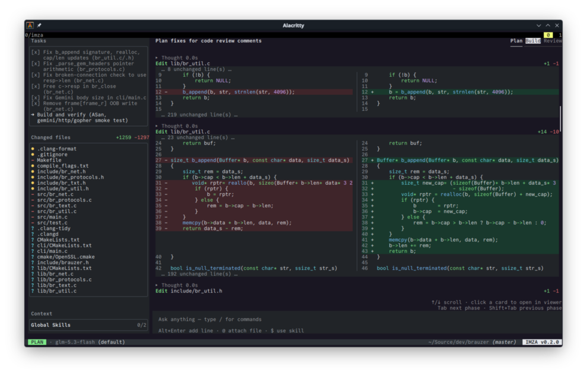

# Imza

Imza is a batteries-included, model-agnostic coding agent with native
performance and a small runtime footprint.

**\~20 MB binary · \~5-8 MB RAM at startup · \~20–40 MB during typical agentic work[^1]**

Bring your own model, open Imza in a project, and describe the
outcome you want. Imza reads the project instructions, gathers context, asks 
questions when needed, and works through the task with visible reasoning,
tool calls, diffs, and approval prompts along the way.

> Imza is not lightweight because it does less.
> It is lightweight because it was designed that way.

Download the [latest release](https://github.com/umutsevdi/imza/releases/latest).



## Why Imza?

Imza organizes development around three modes.

**Plan:** inspect the project, gather context, ask questions, and design an 
implementation without modifying files.

**Build:** edit files, run commands, manage tasks, and delegate work to concurrent 
subagents.

**Review:** inspect the resulting Git diff, generate or manually add review 
comments, then send the findings directly back to Plan mode.

**Plan → Build → Review → Plan → Build**

## Highlights

- Native terminal UI with a small runtime footprint
- Plan → Build → Review workflow
- Interactive diffs and AI-assisted code review
- Up to five concurrent research or build subagents
- Shell-aware, scoped permission controls
- Bring-your-own-model support
- Persistent sessions, transcripts, and automatic context compaction

https://github.com/user-attachments/assets/7e624309-132b-41e0-a59b-68a7b68d0bf9

## Bring Your Own Model

Imza works with OpenAI-compatible endpoints and the Anthropic Messages API,
including locally hosted OpenAI-compatible models.

Use your own API connection, a subscription-backed connection where supported, 
or a locally hosted OpenAI-compatible model.

## Headless mode

Run Imza non-interactively from scripts, CI jobs, or other development tools.
Use `--ask` for a one-shot read-only Plan query or `--exec` for a one-shot
Build task.

Grant only the additional directory and command/subcommand pairs the task
needs:

```sh
./build/debug/imza --exec "build the project and summarize the changes" \
  --allow-dir ../shared-assets \
  --allow-cmd "git status" "cmake --build"
```

`--allow-dir` grants access beneath that directory. A quoted `--allow-cmd`
value such as `"git status"` grants only that command/subcommand pair; a value
containing only the program name grants all of its subcommands for the current
session.

## Custom prompts

Copy any file from [`misc/prompts`](misc/prompts) to Imza's `prompts`
data directory and edit it there. Non-empty files override their embedded
default independently; files not present continue to use the defaults built
into the executable.

- Linux: `$XDG_DATA_HOME/imza/prompts`, or `~/.local/share/imza/prompts`
- macOS: `~/Library/Application Support/imza/prompts`
- Windows: `%APPDATA%\imza\prompts`

## Capabilities

- [X] Streaming Markdown and reasoning
- [X] File reading, editing, and shell commands
- [X] Interactive diffs
- [X] Plan, Build, and Review modes
- [X] Generated and manual review comments
- [X] Review → Plan handoff
- [X] Tool approval flows
- [X] Scoped filesystem and skill permissions
- [X] Structured questions
- [X] Task tracking
- [X] Concurrent subagents
- [X] Persistent subagent transcripts
- [X] Skills and project instructions
- [X] @path file attachments
- [X] $skill attachments
- [X] Prompt queueing and generation interruption
- [X] Automatic context compaction
- [X] Persistent local sessions
- [X] Repository, context, token, and cost information
- [X] OpenAI-compatible APIs
- [X] Anthropic Messages API
- [X] Local OpenAI-compatible servers
- [X] Web search and page fetch
- [X] Subagent configuration
- [X] Syntax highlighting
- [X] Headless mode
- [X] Shell-aware permissions with program and subcommand grants

### Roadmap
- [ ] MCP
- [ ] Image or other multimodal prompt attachments
- [ ] Mid session directory changes
- [ ] Monthly usage analytics (local)
- [ ] Python based extensions
- [ ] Notifications

## Build From Source

Imza requires a C++23 compiler, CMake, Python 3, and libcurl development files.
```sh
git submodule update --init --recursive
cmake -B build -DCMAKE_BUILD_TYPE=Debug -DIMZA_BUILD_TESTS=ON \
  -DCMAKE_EXPORT_COMPILE_COMMANDS=ON
cmake --build build --target imza imza_tests
./build/debug/imza_tests
```

Start Imza from the repository you want it to work in:

```sh
./build/debug/imza
```

On first launch, open `/connect` to add a provider, then use `/model` to choose
a model. Type `/` in the chat input to browse the available commands.

[^1]: Memory use may increase with conversation history, loaded skills, and
Tree-sitter languages used in Review mode.
