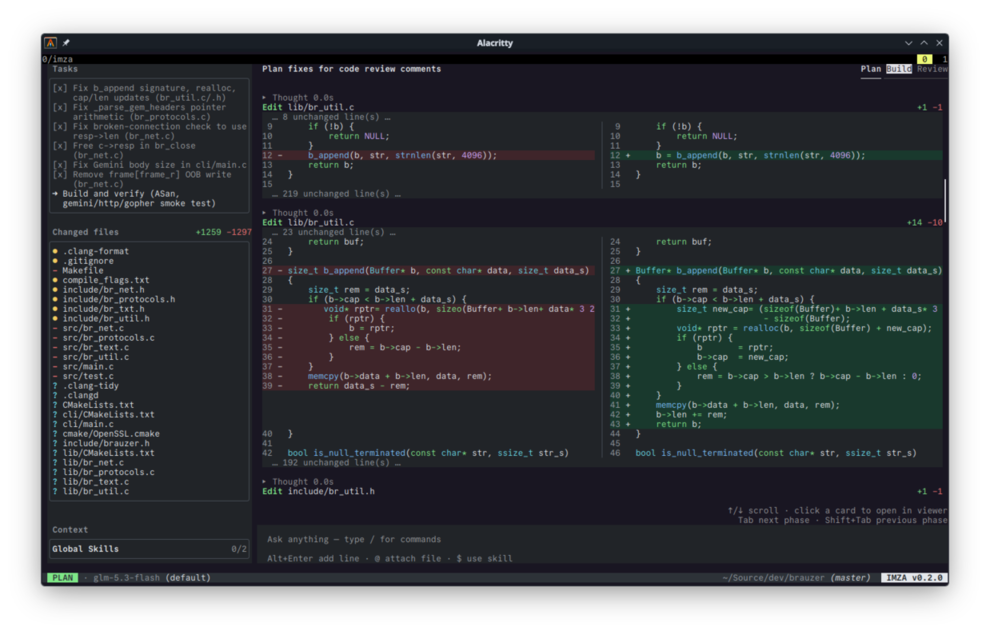

# Imza

**A terminal coding agent that doesn't hide what it does.**

Plan it together, build it together, review it together. Imza speeds up
development without leaving you behind.

> Imza is a native C++ application. It is not lightweight because it does less.

**~20 MB binary · ~5-8 MB RAM at startup · ~20-40 MB during typical agentic
work[^1]**

https://github.com/user-attachments/assets/a0096f0d-8337-4e6b-aabe-f9debe273594

Download the [latest release](https://github.com/umutsevdi/imza/releases/latest).

Browse the [wiki](https://github.com/umutsevdi/imza/wiki) or the
[website](https://imza.run/).

## Why Imza?

Existing coding agents make development faster, but the developer gradually
stops reading the code. Plans, summaries, and tool output start replacing
direct interaction with the implementation, and your understanding of how the
codebase is actually changing falls behind.

Imza is designed to keep the developer inside that implementation loop.
Development is separated into three explicit modes:

- **Plan: build a flawless spec, together.** The agent investigates the
repository, understands the problem, and designs the change without modifying
files. The codebase stays read-only, and the outcome is a plan document: a
Markdown spec with a required skeleton that lives beside the conversation
instead of getting lost in it. Every revision is kept. You can pin notes to
any part of the document and send them back to the agent as one revise
request, iterating until the plan says exactly what you intend.

- **Build: watch the work happen, not a summary.** The agent implements the
plan using edits, commands, subagents, and programmatic tool execution, and
streams every change as a diff the moment it is written. The approved plan
stays with the agent as the reference for the work.

- **Review: read one diff, not a hundred files.** The whole change lands in a
code review tool. Add findings manually or with the agent's help, then send
them back into another planning pass as a new revision of the plan.

This makes review part of the development loop rather than only a final
checkpoint:

**Plan → Build → Review → Plan → Build**

Imza aims to give the agent autonomy over the mechanical work without removing
the developer from the code itself. You still see what is being written, review
the resulting implementation, and decide how the next iteration should proceed.



## Highlights

* Plan → Build → Review workflow built around a co-editable plan document,
with review findings fed back into planning as revisions
* Interactive diffs and AI-assisted code review throughout development
* Sandboxed tool orchestration for fewer round trips and less context overhead
* Shell-aware, scoped permission controls
* Full MCP support
* Sidechat for asking questions without disrupting the main agent's work
* Bring-your-own-model support, including local OpenAI-compatible models
* Native terminal UI with a small runtime footprint
* Up to five concurrent research or build subagents
* Persistent sessions, transcripts, and automatic context compaction
* Overridable prompts: replace any built-in prompt fragment with your own
  Markdown in a `prompts/` directory
* `@path` file and `$skill` skill attachments, plus image and multimodal prompts
* Session-level token, context, and cost usage insight
* Headless execution for scripts, CI, and development tooling
* Terminal notifications when an attended agent finishes or needs input

[Features and roadmap in the wiki](https://github.com/umutsevdi/imza/wiki/11_Features-and-Roadmap)

## Bring Your Own Model

Imza supports OpenAI-compatible endpoints and the Anthropic Messages API,
including locally hosted OpenAI-compatible models.

Use your own API credentials, a subscription-backed connection where supported,
or a model running locally.

## Headless Mode

Run Imza non-interactively from scripts, CI jobs, or other development tools.

Use `--ask` for a one-shot, read-only query or `--exec` for a one-shot
task that can modify files.

Grant only the directories and commands required by the task:

```sh
imza --exec "build the project and summarize the changes" \
  --allow-dir ../shared-assets \
  --allow-cmd "git status" "cmake --build"
```

`--allow-dir` grants access beneath the specified directory.

A quoted `--allow-cmd` value such as `"git status"` grants only that
command/subcommand pair. Providing only the program name grants access to all
of its subcommands for the current session.

## Composable Tool Execution

Instead of requiring a separate model round trip for every read, search, edit,
or command, Imza has the model write sandboxed Lua scripts where reads, edits,
searches, and shell commands compose into one operation.

The model works in bulk and discards data it doesn't need before it ever
reaches your context, making tasks such as filtering files, gathering context,
and performing coordinated edits more efficient.

These operations still go through Imza's permission and mutation tracking
systems, so shell execution, filesystem access, and resulting code changes
remain observable.

In Imza's own development sessions, this approach substantially reduced
intermediate tool output and context overhead.
[Read the analysis](https://github.com/umutsevdi/imza/discussions/1).

## Installation

Pre-built packages are available from the
[latest release](https://github.com/umutsevdi/imza/releases/latest).

> Downloaded macOS packages are currently unsigned. On first launch,
> right-click the application and select Open to allow it through Gatekeeper.

Run `imza` after installation. On first launch, use `/connect` to configure a
provider and `/model` to select a model.

Type `/` in the chat input to browse the available commands.

> Installed builds check for new releases and notify you when one is available.
> Run `imza --update` to install the latest version.

### Building from Source

Want to build Imza yourself or contribute to development?

See the
[build and installation guide](https://github.com/umutsevdi/imza/wiki/01_Installation#building-from-source)
for dependencies, CMake configuration, packaging, and platform-specific
instructions.

---

[^1]: Memory use may increase with conversation history, loaded skills, and
Tree-sitter languages used in Review mode.
